# Relighting Project of UJM

## 3 June 2024
Note:
- Searching for paper in relighting focusing on image processing and colorimetry
- Present a list of approaches on Wednesday
- Make a google slide
- An approach that is lite
- Working hours: 9am-5pm

Reference:
https://papercopilot.com/cat/cs/cg/inverse-rendering/image-relighting/

Category:
- Face relighting
- Fullbody relighting
- General Relighting
- Material Relighting
- Portrait Relighting

List of image based methods
1. Learning to Reconstruct Shape and Spatially-Varying Reflectance from a Single Image
2. Lighting up NeRF via Unsupervised Decomposition and Enhancement
3. MaterialGAN: Reflectance Capture using a Generative SVBRDF Model
4. Deferred Neural Lighting: Free-viewpoint Relighting from Unstructured Photographs
5. Face relighting with radiance environment maps
6. NeLF: Neural Light-transport Field for Portrait View Synthesis and Relighting
7. Neural Light Transport for Relighting and View Synthesis
8. Deep Reflectance Fields: High-Quality Facial Reflectance Field Inference From Color Gradient Illumination
9. Deep Relightable Textures: Volumetric Performance Capture with Neural Rendering
10. Single Image Neural Material Relighting
11. Deep Portrait Delighting
12. DiFaRelilogo: Diffusion Face Relighting

## 4 June 2024

### 1. Face relighting

#### Face relighting with radiance environment maps

##### Summary
- Present a ratio-image based technique to use a radiance environment map to render diffuse objects with different surface reflectance properties. 
- Does not require the separation of illumination from reflectance.

#### NeLF: Neural Light-transport Field for Portrait View Synthesis and Relighting

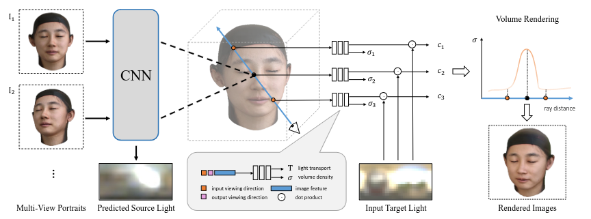

##### Summary
- Introduce the neural light-transport field (NeLF) to infer the light-transport and volume density from a sparse set of input views. - - Enable joint relighting and view synthesis of real portraits from only five input images. 

##### Contribution
- A novel neural representation that models scene appearance as light transport functions and enables relighting for neural volumetric rendering
- A domain adaptation module to enhance the generalizability of the network trained on rendered images
- Realistic practical rendering results of joint relighting and view synthesis of real portraits from only five captured images.

##### Related work
Portrait Appearance; Relighting; View Synthesis; Neural Rendering

##### [Source code](https://github.com/ken2576/nelf)

##### Comparision
SIPR, IBRNet

#### Deep Reflectance Fields: High-Quality Facial Reflectance Field Inference From Color Gradient Illumination

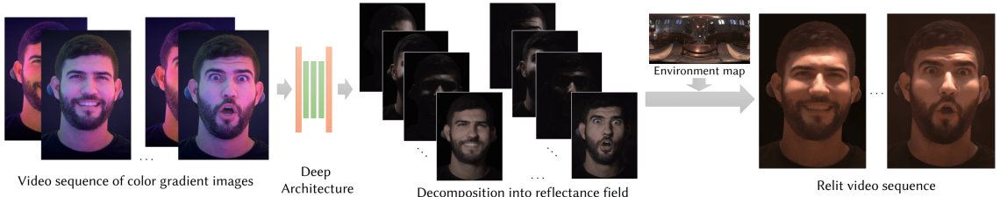

##### Summary

Given only two observations (color gradient images) of an actor, our method is able to relight the subject under any lighting condition. Our approach generalizes to unseen subjects, viewpoints, illumination conditions and can handle dynamic performances. 

##### Contribution
- A capture system that enables 4D reflectance field estimation of moving subjects
- A machine learning-based formulation that maps spherical gradient images to the OLAT image corresponding to a particular lighting direction
- A task-specific perceptual loss trained to pick up specularities and high frequency details
- A sliding window based pooling loss that robustly handles the small misalignments between the spherical gradient images and the groundtruth OLAT image

##### Related work
Parametric Model Fitting; Image-Based Relighting; Learning-Based Techniques

##### Source code
Not available

##### Comparision
Fyffe et al. 2009, Shu et al. 2017, Yamaguchi et al. 2018

#### Face Relighting with Geometrically Consistent Shadows

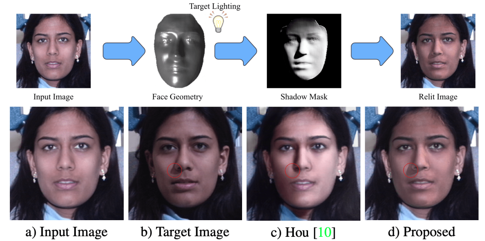

##### Summary
A novel face-relighting method that produces geometrically consistent shadows. By proposing a differentiable algorithm based on the principles of ray tracing that directly uses the face geometry for modeling hard shadows, our method produces physically correct hard shadows which the state-of-the-art face relighting method cannot produce.

##### Contribution
- We propose a single image face relighting method that can produce geometrically consistent hard shadows
- We introduce a novel differentiable algorithm to estimate facial cast shadows based on the estimated geometry
- We achieve SoTA relighting performance on 2 benchmarks quantitatively/qualitatively under directional lights
- Our differentiable hard shadow modeling improves the estimated geometry over models that use diffuse shading

##### Related work
Face Relighting; Differentiable Rendering and Ray Tracing

##### [Source code](https://github.com/andrewhou1/GeomConsistentFR)

##### Comparision
SfSNet, DPR, SIPR, Nestmeyer

### 2. Full body relighting

#### Neural Light Transport for Relighting and View Synthesis

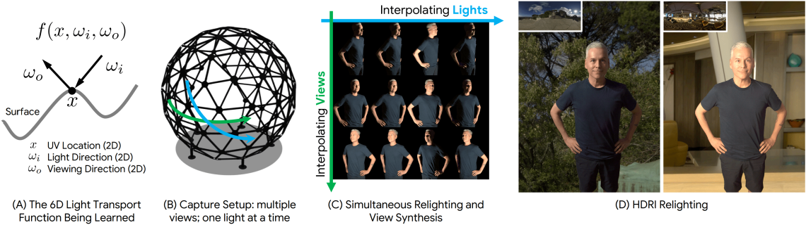

##### Summary
Neural Light Transport (NLT) learns to interpolate the 6D light transport function of a surface as a function of the UV coordinate (2 DOFs), incident light direction (2 DOFs), and viewing direction (2 DOFs). The subject is imaged from multiple viewpoints when lit by different directional lights; a geometry proxy is also captured using active sensors. Querying the learned function at different light and/or viewing directions enables simultaneous relighting and view synthesis of this subject. The relit renderings that NLT produces can be combined according to HDRI maps to perform image-based relighting.

##### Contribution
- An end-to-end, semi-parametric method for learning to interpolate the 6D light transport function per-subject from real data using convolutional neural networks

- A unified framework for simultaneous relighting and view synthesis by embedding networks into a parameterized texture atlas and leveraging as input a set of One-Light-at-A-Time (OLAT) images 
    
- A set of augmented texture-space inputs and a residual learning scheme on top of a physically accurate diffuse base, which together allow the network to easily learn non-diffuse, higher-order light transport effects including specular highlights, subsurface scattering, and global illumination

##### Related work
Single observation; Multiple views; Multiple illuminants; Multiple views and illuminants

##### [Source code](https://github.com/google/neural-light-transport)

##### Comparision
Diffuse Base, Barycentric Blending, Deep Shading, Xu et al., Relightables

#### Deep Relightable Textures: Volumetric Performance Capture with Neural Rendering

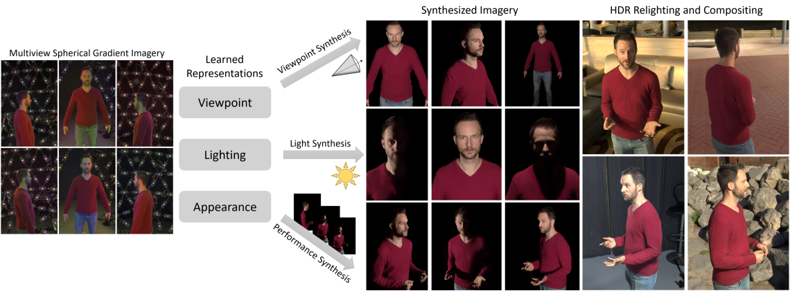

##### Summary
Photo-realistically synthesize and composite dynamic performers under any lighting condition from a desired camera viewpoint. Our framework presents a significant step towards bridging the gap between image-based rendering methods and volumetric videos, enabling exciting possibilities in mixed reality productions.

##### Contribution
- A volumetric capture framework that leverages neural rendering to synthesize photorealistic humans from arbitrary viewpoints under desired illumination conditions
- An approach to build neural textures from multi-view images to render the full reflectance field for unseen dynamic performances of humans, including occlusion shadows and an alpha compositing mask. This overcomes the issues of previous works using neural textures that need to be re-trained for every new UV parameterization
- High quality results on free-viewpoint videos with dynamic performers, extensive evaluations and comparisons to show the efficacy of the method and substantial improvements over existing state-of-the-art systems

##### Related work
Multi-view 3D Performance Capture; Full body performance capture; Neural Rendering

##### Source code
Not available

##### Comparision
Guo et al. [2019] Thies et al. [2019] Martin-Brualla et al. [2018] Wenger et al. [2005a] [Meka et al. 2019]

### 3. General relighting

#### PS-NeRF: Neural Inverse Rendering for Multi-view Photometric Stereo

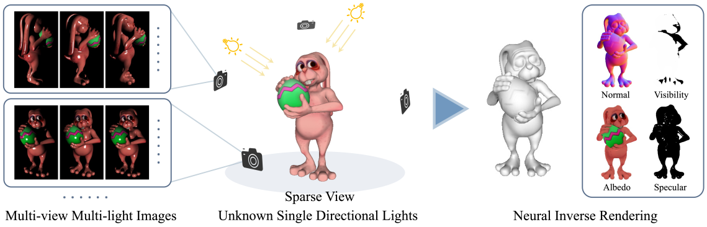

##### Summary
Our method takes multi-view multi-light images as input, and is able to reconstruct accurate surface and faithful BRDFs based on our shadow-aware renderer. Specifically, we only take images under sparse views with each view illuminated by multiple unknown single directional lights.

##### Contribution
- We introduce a neural inverse rendering method for multi-view photometric stereo, which jointly optimizes shape, BRDFs, and lights based on a shadowaware differentiable rendering layer
- We propose to regularize the surface normals derived from the radiance field with normals estimated from multi-light images, which significantly improves surface reconstruction, especially for sparse input views (e.g., 5 views)
- Our method achieves state-of-the-art results in MVPS, and demonstrates that incorporating multi-light information appropriately can produce a far more accurate shape reconstruction

##### Related work
Single-view Photometric stereo (PS); Multi-view Photometric Stereo (MVPS); Neural Rendering

##### Source code
Not available

##### Comparision
NeRF, PhySG, NeRFactor, NeRF, NRF, UNISURF

#### MII: Modeling Indirect Illumination for Inverse Rendering

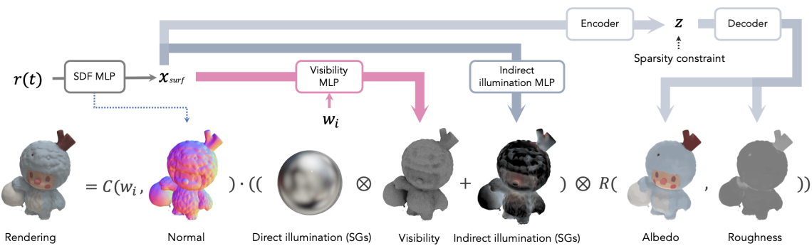

##### Summary

To precisely recover SVBRDF (parameterized as albedoand roughness) from multi-view RGB images, we propose an efficient approach to reconstruct spatially varying indirect illumination and combine it with environmental light evaluated by visibility as the full light model (a). The example in (b) demonstrates thatwithout modeling indirect illumination, its rendering effects arebaked into the estimated albedo to compensate for the incompletelight model and also result in artifacts in the estimated roughness.

##### Related work
Inverse rendering; Implicit neural representation; Inverse rendering with implicit neural representation; The rendering equation

##### [Source code](https://github.com/zju3dv/invrender)

##### Comparision
NeRFactor, PhySG

#### NeRFactor: Neural Factorization of Shape and Reflectance Under an Unknown Illumination

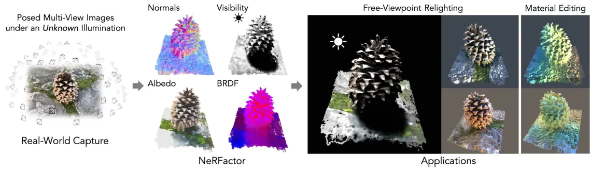

##### Summary
The input to NeRFactor is assumed to be only multi-view images (and their camera poses) of an object lit by one unknown illumination condition. NeRFactor represents the shape and spatially-varying reflectance of an object as a set of 3D fields, each parameterized by Multi-Layer Perceptrons (MLPs) whose weights are optimized so as to “explain” the set of observed input images. After optimization, NeRFactor outputs, at each 3D location ? on the object’s surface, the surface normal ?, light visibility in any direction ?(?i), albedo ?, and reflectance ?BRDF that together explain the observed appearance?. By recovering the object’s geometry and reflectance, NeRFactor en- ables applications such as free-viewpoint relighting (with shadows) and material editing.

##### Contribution
- Bi et al. [2020] and NeRV [Srinivasan et al. 2021] require multiple known lighting conditions, while NeRFactor handles just one unknown illumination
- NeRD [Boss et al. 2021] does not model visibility or shad- ows, while NeRFactor does, successfully separating shadows from albedo (as will be shown). NeRD uses an analytic BRDF, whereas NeRFactor uses a learned BRDF that encodes priors
- PhySG [Zhang et al. 2021b] does not model visibility or shad- ows and uses an analytic BRDF, just like NeRD. In addition, PhySG assumes non-spatially-varying reflectance, while NeRFactor models spatially-varying BRDFs

##### Related work
Inverse Rendering

##### [Source code](https://github.com/google/nerfactor)

#### Learning to Reconstruct Shape and Spatially-Varying Reflectance from a Single Image

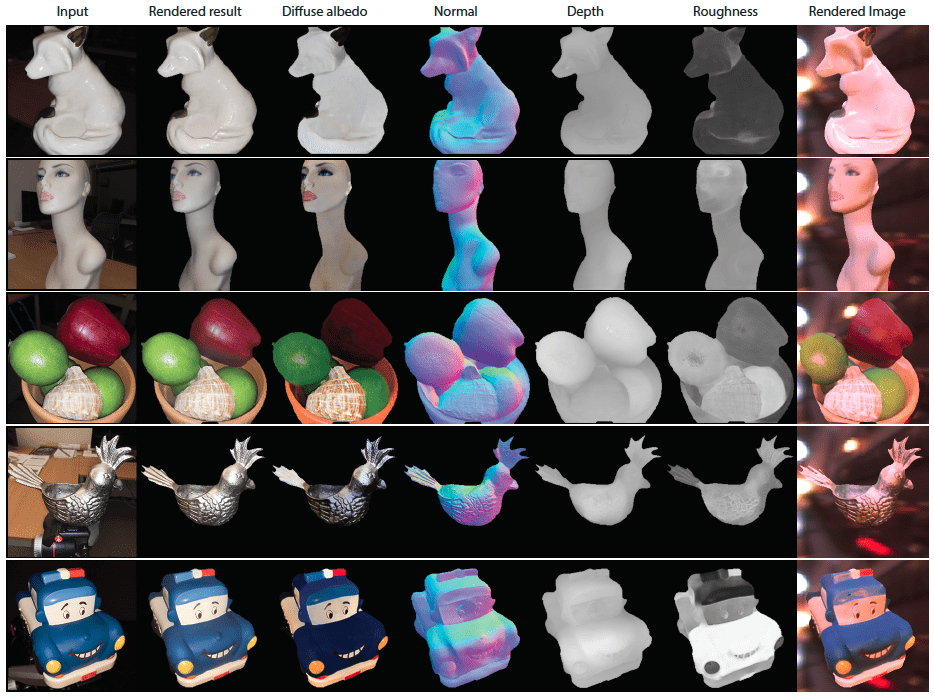

##### Summary
The input to our method is a single image of an object (with a mask) captured under (dominant) flash and environment illumination. Reconstructing spatially-varying BRDF (SVBRDF) and shape, in such uncontrolled settings, is an extremely ill-posed problem. Inspired by the recent success of deep learning methods in computer vision and computer graphics, we handle this problem by training a CNN specifically designed with intuition from physics-based methods.

##### Contribution
- The first approach to simultaneously recover unknown shape and SVBRDF using a single mobile phone image
- A new large-scale dataset of images rendered with complex shapes and spatially-varying BRDF
- A novel cascaded network architecture that allows for global reasoning and iterative refinement
- A novel, physically-motivated global illumination rendering layer that provides more accurate reconstructions

##### Related work
Shape and Material Estimation; Deep Learning for Inverse Rendering; Rendering Layers in Deep Networks; Cascade Networks

##### [Source code](https://github.com/lzqsd/SingleImageShapeAndSVBRDF)

#### Shape, Light, and Material Decomposition from Images using Monte Carlo Rendering and Denoising

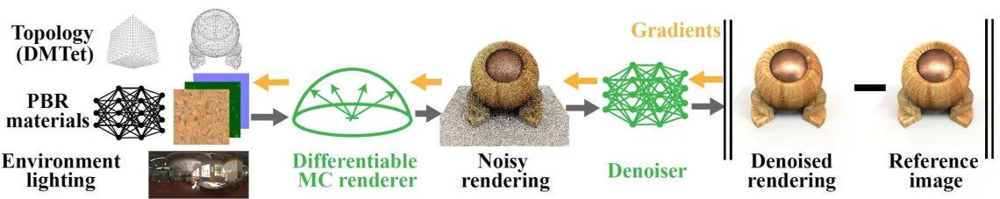

##### Summary
We learn topology, materials, and environment map lighting jointly from 2D supervision. We directly optimize topology of a triangle mesh, learn materials through volumetric texturing, and leverage Monte Carlo rendering and denoising. Our output representation is a triangle mesh with spatially varying 2D textures and a high dynamic range environment map, which can be used unmodified in standard game engines. Knob model by Yasutoshi Mori, adapted by Morgan McGuire.

##### Contribution

##### Related work
Neural methods for multi-view reconstruction; BRDF and lighting estimation; Image denoisers

##### [Source code](https://github.com/NVlabs/nvdiffrecmc)

##### Comparision
nvdiffrec, NeRFactor

#### PhySG: Inverse Rendering with Spherical Gaussians for Physics-based Material Editing and Relighting

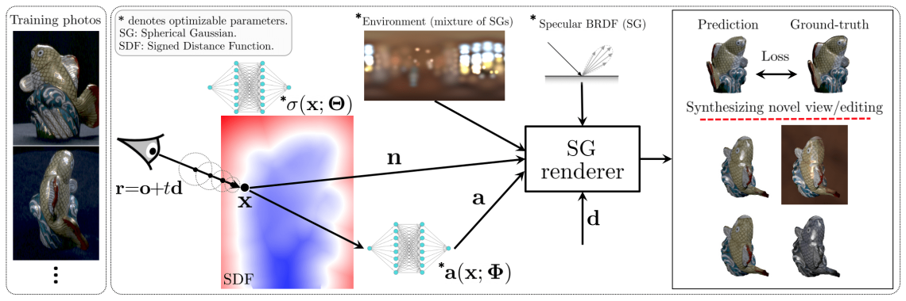

##### Summary
We present PhySG, an end-to-end inverse rendering pipeline that includes a fully differentiable renderer and can reconstruct geometry, materials, and illumination from scratch from a set of RGB input images. Our framework represents specular BRDFs and environmental illumination using mixtures of spherical Gaussians, and represents geometry as a signed distance function parameterized as a Multi-Layer Perceptron. The use of spherical Gaussians allows us to efficiently solve for approximate light transport, and our method works on scenes with challenging non-Lambertian reflectance captured under natural, static illumination. We demonstrate, with both synthetic and real data, that our reconstructions not only enable rendering of novel viewpoints, but also physics-based appearance editing of materials and illumination.

##### Contribution
- PhySG, an end-to-end inverse rendering approach to this problem of jointly estimating lighting, material properties, and geometry from multi-view images of glossy objects under static illumination. Our pipeline utilizes spherical Gaussians to approximately and efficiently evaluate the rendering equation in closed form
- Compared to prior neural rendering approaches, we show that PhySG not only generalizes to novel viewpoints, but also enables physically-intuitive material editing and relighting

##### Related work
Neural Rendering; Material and Environment Estimation; Joint Shape and Appearance Refinement; The Rendering Equation

##### [Source code](https://github.com/Kai-46/PhySG)

##### Comparision
NeRF, IDR, DVR

#### Weakly-supervised Single-view Image Relighting

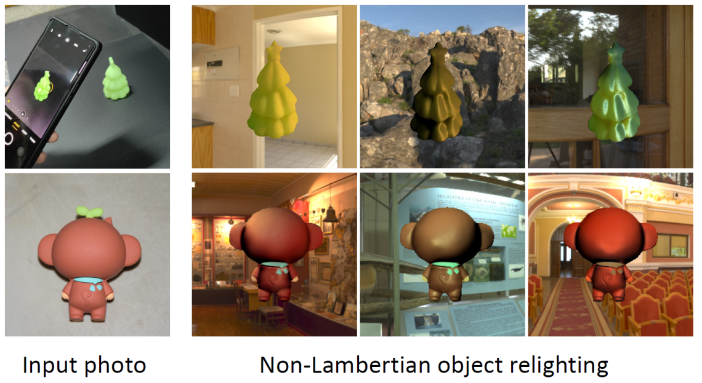

##### Summary
At training time, Spec-Net separates input images into specular and diffuse branches. Spec-Net, Normal-Net and Light-Net are trained in a self-supervised manner by the Relit dataset. At inference time, inverse rendering properties are predicted to relight the object under novel lighting and material. The non-Lambertian render layers produce realistic relit images. 

##### Contribution
- A weakly-supervised inverse rendering pipeline trained with a low-rank loss. The correctness and convergence of the loss are mathematically proven
- A large-scale dataset of foreground-aligned videos collecting 750K images of 100+ real objects under different lighting conditions
- An Android app implementation for amateur users to make a home-run

##### Related work
Inverse Rendering; Image Relighting

##### [Source code](https://github.com/renjiaoyi/imagerelighting)

#### MaterialGAN: Reflectance Capture using a Generative SVBRDF Model

##### Summary
A method to capture SVBRDF material maps from a small number of mobile flash photographs, achieving high quality results both on original and novel views. Our key innovation is optimization in the latent space of MaterialGAN, a generative model trained to produce plausible material maps; MaterialGAN thus serves as a powerful implicit prior for result realism. Here we show re-rendered views for several different materials under environment illumination. We use 7 inputs for these results (with 2 of them shown).

##### Related work
Reflectance Capture; Generative Adversarial Networks

##### [Source code](https://github.com/tflsguoyu/materialgan)

#### Neural-PIL: Neural Pre-Integrated Lighting for Reflectance Decomposition

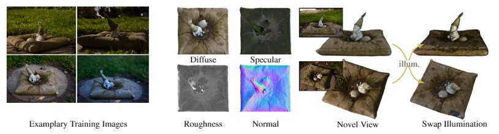

##### Summary
Our neural-PIL based technique decomposes images observed under unknown illumination into high-quality BRDF, shape and illuminations. This allows us to then synthesize novel views (targets shown in insets) and perform relighting or illumination transfer.

##### Contribution
- We aim to replace the costly illumination integration step within these rendering approaches with a learned network
- We also present a smooth manifold auto-encoder (SMAE), based on interpolating auto-encoders, that can learn effective low-dimensional representations of light and BRDFs

##### Related work
Coordinate-based MLPs;BRDF estimation;Illumination estimation

##### [Source code](https://github.com/cgtuebingen/Neural-PIL)

#### Deferred Neural Lighting: Free-viewpoint Relighting from Unstructured Photographs

##### Summary
In this paper we present a novel image-based method for 360? free-viewpoint relighting from unstructured photographs that borrows ideas from model-based approaches, without the stringent accuracy demands on the components, and that leverages neural networks to reduce the complexity of typical image-based acquisition procedures.

##### Contribution
- a novel end-to-end system that enables full 360? free-viewpoint relighting from unstructured handheld captured photographs for a wide range of material properties and light transport effects
- a deferred neural lighting renderer suitable for a wide range of lighting conditions
- a novel handheld acquisition scheme that only requires two cameras
- an augmentation method for extending the relighting capabilities of our neural rendering network beyond the acquisition lighting

##### Related work
Appearance Modeling; Joint Modeling of Shape and Appearance; Image-based Rendering; Image-based Relighting

##### [Source code](https://github.com/msraig/DeferredNeuralLighting)

#### NeRD: Neural Reflectance Decomposition from Image Collections

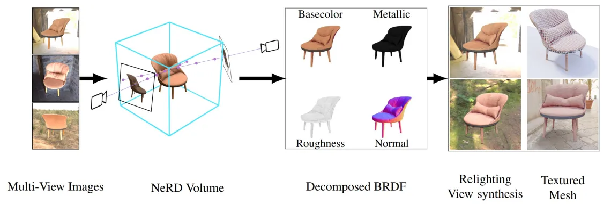

##### Summary
This paper proposed a novel method to decompose image collections from multiple views taken under varying or fixed illumination conditions. By introducing physically-based lighting and appearance representations, this method can relight an object, and information can be extracted from the neural volume.

##### Contribution
- We propose a neural reflectance decomposition (NeRD) technique that uses physically-based rendering to decompose the scene into spatially varying BRDF material properties
- We also propose techniques to convert the learned reflectance volume into a relightable textured mesh enabling fast real-time rendering with novel illuminations

##### Related work
Neural scene representations; BRDF estimation

##### [Source code](https://github.com/cgtuebingen/NeRD-Neural-Reflectance-Decomposition)

##### Comparision
NeRF, NeRF-A

#### NeRV: Neural Reflectance and Visibility Fields for Relighting and View Synthesis

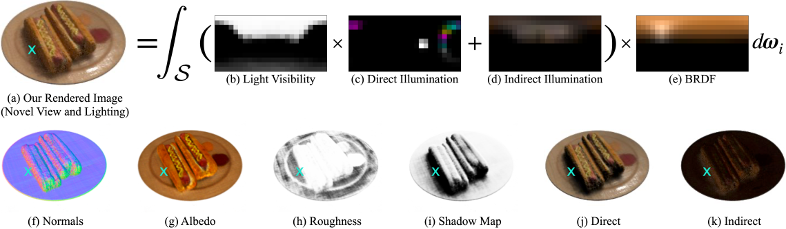

##### Summary
We optimize a Neural Reflectance and Visibility Field (NeRV) 3D representation from a set of input images of a scene illuminated by known but unconstrained lighting. Our NeRV representation can be rendered from novel views under arbitrary lighting conditions not seen during training.

##### Contribution
In this work, we present a method to train a NeRF-like model that can simulate realistic environment lighting and global illumination. Our key insight is to train an MLP to act as a lookup table into a visibility field during rendering

##### Related work
Neural Radiance Fields; Implicit geometry representations

##### Source code
Not available

##### Comparision
NeRF

### 4. Material relighting

#### Look-Ahead Training with Learned Reflectance Loss for Single-Image SVBRDF Estimation

##### Contribution
- We propose a novel training strategy for single image SVBRDF estimation to achieve robustness to overfitting during the testtime optimization
- We present a learned reflectance loss to compliment the rendering loss during the test-time optimization
- We extensively compare our approach against several stateof-the-art methods on various datasets, including our new dataset of real images with ground truth

##### [Source code](https://github.com/xilongzhou/lookahead_svbrdf)

#### Single Image Neural Material Relighting

##### Summary
This paper presents a novel neural material relighting method for revisualizing a photograph of a planar spatially-varying material under novel viewing and lighting conditions. Our approach is motivated by the observation that the plausibility of a spatially varying material is judged purely on the visual appearance, not on the underlying distribution of appearance parameters. Therefore, instead of using an intermediate parametric representation (e.g., SVBRDF) that requires a rendering stage to visualize the spatially-varying material for novel viewing and lighting conditions, neural material relighting directly generates the target visual appearance. We explore and evaluate two different use cases where the relit results are either used directly, or where the relit images are used to enhance the input in existing multi-image spatially varying reflectance estimation methods. We demonstrate the robustness and efficacy for both use cases on a wide variety of spatially varying materials.

##### Related work
Relighting; SVBRDF Estimation

##### Source code
Not available

### 5. Portrait relighting
#### Deep Portrait Delighting

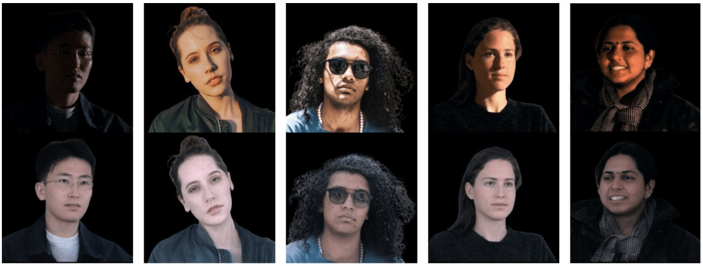

##### Summary
Given a portrait image, we perform delighting: removing undesirable lighting characteristics and reconstructing the image under uniform lighting.

##### Contribution
- A novel portrait delighting method that can recover the underlying texture of portraits illuminated under a wide range of complex lighting environments
- Three novel loss functions: shading-offset loss, soft-shadow loss and masked loss that improve our models robustness to unseen lighting environments while preserving image detail
- Our delighting method can serve as a data normalization tool for improving light-sensitive computer vision tasks such as face relighting and semantic parsing

##### Source code
Not available
